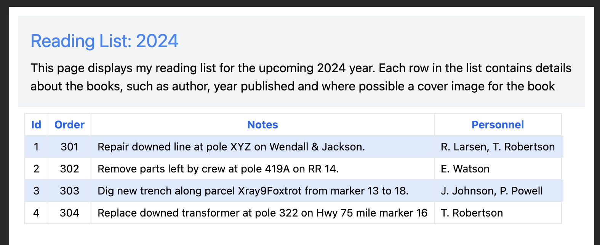

# AlpineJS & Hapi Proof of Concept

This is a proof of concept and learning application for using [Alpine.js][f1] and [Hapi][f2]
as the stack for implementing the database api and its consumption for a project I 
am working on.  The database will be an instance of PostgreSQL but that should not 
matter. I will also be trying to use an ORM for the data access layer.

## Overview
The proof of concept application is a simple web app using HTML, [Tailwind CSS][f3], and Javascript.
Data-driven content is provided using [alpine] which is a super lightweight set of 
attributes and couple functions that provide the ability to import and bind data into 
the html page and loop through the records to display them.  The REST API that will be 
used to fetch the data from the [PostgreSQL][f4] database instance. 

The target project for which this proof of concept stack will eventually serve uses a rather
old and large UI template that uses Gulp and SASS and a lot of minification and transpilation
steps that is already complicated enough.  The goal of this tech stack is to not to add more
complexity than is absolutely necessary.

## Alpine.js
The goal of using [Alpine.js][f1] is to keep the application simple.  The entire library
only consists of 15 attributes, 6 properties, and 2 functions and will still provide all
of the functionality needed to perform CRUD operations on data fetched from the database.
Each of the attributes goes into the HTML elements and facilitate data binding, loops, and
conditionals without requiring nested Javascript. This keeps more of the code declarative
and simple.  

## Hapi
The use of [Hapi][f2] as the API server framework was just due to its maturity and its 
being used by large companies successfully. Alternatives are [Sequelize(JS)][f6] and 
[NestJS(JS or TS)][f5] and based on how the API development goes in this POC I may end
up going with one of the alternatives.  But I will stick with Hapi at first, I have used 
it in one other [small app][f7] so I am a little familiar with it.

## Results
To be determined...

[f1]: https://alpinejs.dev
[f2]: https://hapi.dev
[f3]: https://tailwindcss.com
[f4]: https://postgresql.org
[f5]: https://nestjs.com
[f6]: https://sequelize.org
[f7]: https://github.com/elusive/simple-football-hapi
